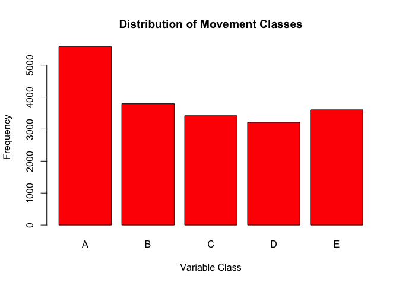

# Activity based machine learning (ML)
Bjoern W. Steffens  
11 June 2016  


## Intro

Using devices such as Jawbone Up, Nike FuelBand, and Fitbit it is now possible to collect a large amount of data about personal activity relatively inexpensively. These type of devices are part of the quantified self movement – a group of enthusiasts who take measurements about themselves regularly to improve their health, to find patterns in their behavior, or because they are tech geeks. One thing that people regularly do is quantify how much of a particular activity they do, but they rarely quantify how well they do it. In this project, your goal will be to use data from accelerometers on the belt, forearm, arm, and dumbell of 6 participants. They were asked to perform barbell lifts correctly and incorrectly in 5 different ways. More information is available from the website here: [http://groupware.les.inf.puc-rio.br/har](http://groupware.les.inf.puc-rio.br/har) (see the section on the Weight Lifting Exercise Dataset).

The data for this project come from this source: [http://groupware.les.inf.puc-rio.br/har](http://groupware.les.inf.puc-rio.br/har). If you use the document you create for this class for any purpose please cite them as they have been very generous in allowing their data to be used for this kind of assignment.

## Results

I tested and verified a tree model against a random forest model. The random forest model was more accurate and that one was selection. See next section for the code and proof around the selection process.

## R code, evidence of model selection and prediction accuracy


```r
setwd("~/mycloud/Private_DataScience/Coursera/10 Data Science Specialisation/70 Practical Machine Learning/Assignments")
rm(list=ls())

require(dplyr)
require(caret)
require(randomForest)
require(rpart)
require(rpart.plot)

#
# Acquire and load the files
tstFile <- "https://d396qusza40orc.cloudfront.net/predmachlearn/pml-testing.csv"
trnFile <- "https://d396qusza40orc.cloudfront.net/predmachlearn/pml-training.csv"
if ( !file.exists("tst.csv") && !file.exists("trn.csv") ) {
    
    download.file(tstFile, "tst.csv")
    download.file(trnFile, "trn.csv")
    
}

tst = read.csv("tst.csv",na.strings=c("NA","#DIV/0!"))
trn = read.csv("trn.csv",na.strings=c("NA","#DIV/0!"))

# ** CLEAN THE DATA
#
# Remove columns that may not influence
# the prediction
dropCols <- c("X","user_name",
              "raw_timestamp_part_1",
              "raw_timestamp_part_2",
              "cvtd_timestamp",
              "num_window", "new_window")
tst[,dropCols] <- NULL
trn[,dropCols] <- NULL

#
# There is a ton of cols with NAs. Remove them too
tst  <- tst[,colSums(is.na(tst)) == 0]
trn <- trn[,colSums(is.na(trn)) == 0]

# ** START PREPARING THE DATA
# Split up the training set to enable
# cross validation
trnArray  <- createDataPartition(y=trn$classe, p=0.99885, list=FALSE)
trnLarge  <- trn[ trnArray,]
trnSubset <- trn[-trnArray,]


#
# How does this look like?
plot(trnLarge$classe, col="red", main="Distribution of Movement Classes", xlab="Variable Class", ylab="Frequency")
```

<!-- -->

```r
# ** CREATE MODELS AND COMPARE
# Train the model, create the prediction 
# and then verify how acurate it is
mod1  <- rpart(classe ~ ., data=trnLarge, method="class")
pred1 <- predict(mod1, trnSubset, type = "class")
rpart.plot(mod1, main="Tree View", branch = 1, fallen.leaves = TRUE, uniform = TRUE)
```

<!-- -->

```r
confusionMatrix(pred1, trnSubset$classe)
```

```
## Confusion Matrix and Statistics
## 
##           Reference
## Prediction A B C D E
##          A 6 0 0 0 0
##          B 0 4 0 0 1
##          C 0 0 2 0 0
##          D 0 0 1 2 0
##          E 0 0 0 1 3
## 
## Overall Statistics
##                                           
##                Accuracy : 0.85            
##                  95% CI : (0.6211, 0.9679)
##     No Information Rate : 0.3             
##     P-Value [Acc > NIR] : 5.427e-07       
##                                           
##                   Kappa : 0.8083          
##  Mcnemar's Test P-Value : NA              
## 
## Statistics by Class:
## 
##                      Class: A Class: B Class: C Class: D Class: E
## Sensitivity               1.0   1.0000   0.6667   0.6667   0.7500
## Specificity               1.0   0.9375   1.0000   0.9412   0.9375
## Pos Pred Value            1.0   0.8000   1.0000   0.6667   0.7500
## Neg Pred Value            1.0   1.0000   0.9444   0.9412   0.9375
## Prevalence                0.3   0.2000   0.1500   0.1500   0.2000
## Detection Rate            0.3   0.2000   0.1000   0.1000   0.1500
## Detection Prevalence      0.3   0.2500   0.1000   0.1500   0.2000
## Balanced Accuracy         1.0   0.9688   0.8333   0.8039   0.8438
```

```r
#
# Train the other model, create the prediction 
# and then verify how acurate it is
mod2  <- randomForest(classe ~. , data=trnLarge, method="class")
pred2 <- predict(mod2, trnSubset, type = "class")
plot(mod2)
```

<!-- -->

```r
confusionMatrix(pred2, trnSubset$classe)
```

```
## Confusion Matrix and Statistics
## 
##           Reference
## Prediction A B C D E
##          A 6 0 0 0 0
##          B 0 4 0 0 0
##          C 0 0 3 0 0
##          D 0 0 0 3 0
##          E 0 0 0 0 4
## 
## Overall Statistics
##                                      
##                Accuracy : 1          
##                  95% CI : (0.8316, 1)
##     No Information Rate : 0.3        
##     P-Value [Acc > NIR] : 3.487e-11  
##                                      
##                   Kappa : 1          
##  Mcnemar's Test P-Value : NA         
## 
## Statistics by Class:
## 
##                      Class: A Class: B Class: C Class: D Class: E
## Sensitivity               1.0      1.0     1.00     1.00      1.0
## Specificity               1.0      1.0     1.00     1.00      1.0
## Pos Pred Value            1.0      1.0     1.00     1.00      1.0
## Neg Pred Value            1.0      1.0     1.00     1.00      1.0
## Prevalence                0.3      0.2     0.15     0.15      0.2
## Detection Rate            0.3      0.2     0.15     0.15      0.2
## Detection Prevalence      0.3      0.2     0.15     0.15      0.2
## Balanced Accuracy         1.0      1.0     1.00     1.00      1.0
```

```r
#
# Random Forests seems to be more acurate vs deciscion tree.
# Apply the better model to the test set
predFin1 <- predict(mod1, tst, type = "class")
predFin2 <- predict(mod2, tst, type = "class")

# Less Accurate Model
print(predFin1)
```

```
##  1  2  3  4  5  6  7  8  9 10 11 12 13 14 15 16 17 18 19 20 
##  B  A  B  A  A  C  D  A  A  A  C  B  C  A  E  E  A  B  B  B 
## Levels: A B C D E
```

```r
# More Accurate Model
print(predFin2)
```

```
##  1  2  3  4  5  6  7  8  9 10 11 12 13 14 15 16 17 18 19 20 
##  B  A  B  A  A  E  D  B  A  A  B  C  B  A  E  E  A  B  B  B 
## Levels: A B C D E
```

